# 프로젝트 개요
- Python Django로 To-do List를 만들어본다. 

# 파이썬 설치
- 파이썬 설치는 Anaconda 또는 Python 홈페이지에서 직접 설치한다.
    + Anaconda : https://www.anaconda.com/
    + Python : https://www.python.org/

# 가상환경 설치
- 파이썬 설치가 끝났다면, 개인 Repo를 생성 한 후, 깃허브를 다운로드 받는다.  
```bash 
$ git clone https://github.com/dschloe/django_to_do.git
```

- django_to_do(예시) 폴더에 진입 후 아래와 같이 실행한다. 
```bash
$ cd django_to_do
$ virtualenv venv
created virtual environment CPython3.9.7.final.0-64 in 7884ms     
  creator CPython3Windows(dest=C:\Users\human\Desktop\django_to_do\venv, clear=False, no_vcs_ignore=False, global=False)
  seeder FromAppData(download=False, pip=bundle, setuptools=bundle, wheel=bundle, via=copy, app_data_dir=C:\Users\human\AppData\Local\pypa\virtualenv)
    added seed packages: pip==22.0.4, setuptools==62.1.0, wheel==0.37.1
  activators BashActivator,BatchActivator,FishActivator,NushellActivator,PowerShellActivator,PythonActivator
```

- 실제 실행 후 venv 폴더가 나타나는지 확인한다. 
```bash
$ ls
README.md  venv/
```

- 가상환경에 접속한다. 
```bash
$ source venv/Scripts/activate
(venv)
```

# 환경 설정 Django

## Installing Django
- Django : https://www.djangoproject.com/
- 가상환경이 접속된 상태에서 `django`와 시간 계산을 위해 `pytz`를 설치한다. 
```bash
$ pip install django pytz
```

## djanog 개발 시작
- 이제 `django` 프로젝트를 시작한다. 
- `django` 설치 후, `todo_app` 폴더와 `manage.py`가 실행되는지 확인한다. 
```bash
$ django-admin startproject todo_app .
$ ls
manage.py*  todo_app/
```

## 초기 화면 실행
- 서버를 구동시킨다. 
    + 접속 URL : http://127.0.0.1:8000/
```bash
$ python manage.py runserver
```
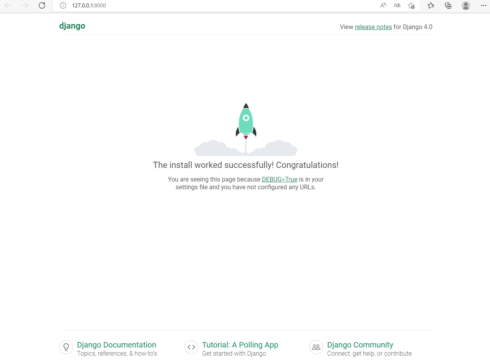

- 이번에는 해당 서버에서 http://127.0.0.1:8000/admin을 실행시킨다. 
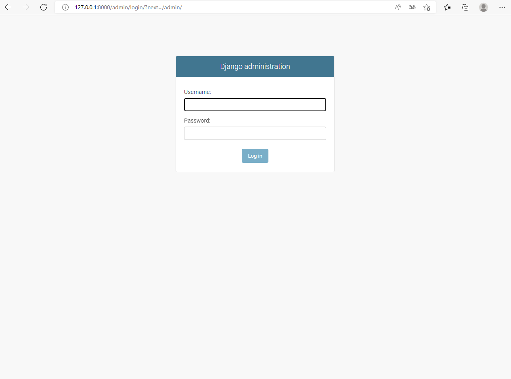

- DB 스키마 생성 위해 이번에는 `python manage.py migrate`를 실행한다. 

```bash
$ python manage.py migrate
```

## 관리자 유저 생성
- 관리자 유저를 생성하도록 한다. 
    + username : human
    + password : 
```bash
$ python manage.py createsuperuser
Username (leave blank to use 'yourname'): 
Email address: your_email@email.com
Password: 
Password (again):
```

- 이제 다시 admin 페이지에 접속하고, `username`과 `password`를 입력한다. 
    + 정상적으로 입력하면 아래와 같이 로그인이 되면 성공이다. 
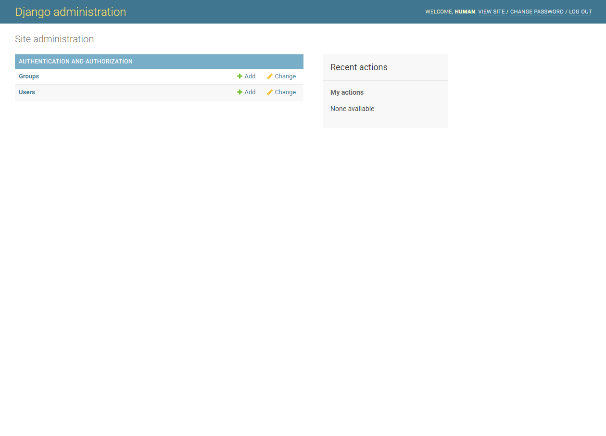

# todo_list 웹 폴더 생성
- `todo_app`은 메인 앱이라 생각하면 되고, 하단에 todo_list 서브앱을 생성한다. 
```bash
$ python manage.py startapp todo_list
$ ls
db.sqlite3  manage.py*  todo_app/  todo_list/
```

- 이번에는 todo_app에 `todo_list` 웹을 등록하는 코드를 작성한다. 
  + `todo_list`를 추가한다.
  + 파일경로 : todo_app/settings.py
```python
.
.
INSTALLED_APPS = [
    'django.contrib.admin',
    'django.contrib.auth',
    'django.contrib.contenttypes',
    'django.contrib.sessions',
    'django.contrib.messages',
    'django.contrib.staticfiles',
    'todo_list',
]
.
.
```

## urls.py 수정
- 먼저, `todo_app` 폴더 하단에 `urls.py` 코드에 아래 코드를 추가한다. 
- 아래 코드는 웹사이트의 경로를 지정해주는 코드다.
```python
from django.contrib import admin
from django.urls import path, include
from todo_list import views

urlpatterns = [
    path('admin/', admin.site.urls),
    path('', include('todo_list.urls')),
]
```

## 기본 페이지 만들기
- 주의) 파일 경로를 잘 확인한다. 
- 우선, `runserver` 실행 시, `Hello World`가 나타나도록 만들어본다.
- 먼저, `views.py`에 다음과 같은 코드를 생성한다. 
  + 파일경로 : `todo_list/views.py`
  + `home.html` 파일은 바로 생성할 것이다. 

```python
from wsgiref.util import request_uri
from django.shortcuts import render

# Create your views here.
def home(request):
    return render(request, 'home.html', {})
```
- `templates` 폴더를 생성한 뒤, `home.html`과 `about.html` 파일을 생성하고, 간단하게 아래코드를 추가한다. 
- `home.html`
  + 파일경로 : `todo_list/templates/home.html`
```html
<h1>Hello World! HomePage!!</h1>
```

- `about.html`
  + 파일경로 : `todo_list/templates/about.html`

```
<h1>about Page</h1>
```

- 이번에는 todo_list 폴더 하단에 urls.py를 생성한다. 
  + 다음 코드를 추가한다. 

```python
from django.urls import path
from . import views

urlpatterns = [
    path('', views.home, name='home'), 
    path('about/', views.about, name='about'),
]
```

- 파일이 완성되었다면 runserver를 실행한다. 그림에서 보는 것처럼 about 페이지가 만들어진 것을 확인할 수 있다. 
```bash
$ python manage.py runserver
```

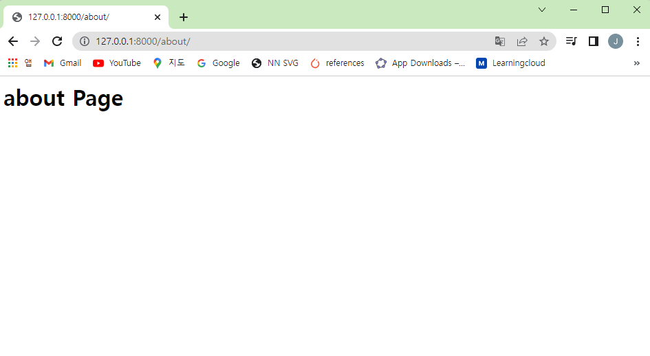

### base html 파일
- 기본 상단 메뉴 또는 하단 정보창을 고정 시킬 때 사용한다. 
- 이를 모든 html마다 반복해서 작성하는 것은 비효율적이기 때문임
- 따라서 base를 만들고 이를 활용하면, 새 작성 페이지의 기능에만 집중하여 효율적인 코드 작성이 가능해진다. 
- base html 파일을 작성한다. 
  + 파일 경로: todo_list/templates/base.html
```html
모든 페이지에 적용



```

### home html 파일 추가
- 이제 home.html 파일에 base.html 파일을 적용하도록 한다. 
- 최상단에 ``을 추가한다. 
```html



<h1>Hello World! HomePage!!</h1>

```

- 결과는 다음과 같다. 
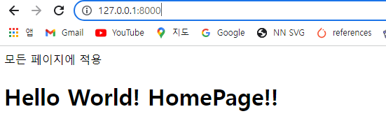

- 그런데 about 페이지를 확인하면 적용이 안되어 있을 것이다. 
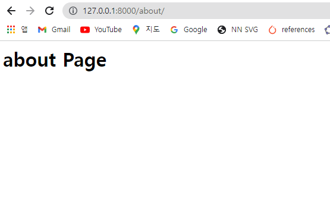


## Installing Bootstrap
- URL : https://getbootstrap.com/docs/5.1/getting-started/introduction/
- Bootstrap 템플릿을 base.html 파일에 적용하도록 한다.

### (1) 기본환경 설정
- 우선 bootstrap에서 기본 환경을 설정하도록 한다. 

```html
<!doctype html>
<html lang="en">
  <head>
    <!-- Required meta tags -->
    <meta charset="utf-8">
    <meta name="viewport" content="width=device-width, initial-scale=1">

    <!-- Bootstrap CSS -->
    <link href="https://cdn.jsdelivr.net/npm/bootstrap@5.1.3/dist/css/bootstrap.min.css" rel="stylesheet" integrity="sha384-1BmE4kWBq78iYhFldvKuhfTAU6auU8tT94WrHftjDbrCEXSU1oBoqyl2QvZ6jIW3" crossorigin="anonymous">

    <title> Hello, world!  </title>
  </head>
  <body>
    <br/>
    <div class="container">
        
        
    </div>

    <!-- Optional JavaScript; choose one of the two! -->

    <!-- Option 1: Bootstrap Bundle with Popper -->
    <script src="https://cdn.jsdelivr.net/npm/bootstrap@5.1.3/dist/js/bootstrap.bundle.min.js" integrity="sha384-ka7Sk0Gln4gmtz2MlQnikT1wXgYsOg+OMhuP+IlRH9sENBO0LRn5q+8nbTov4+1p" crossorigin="anonymous"></script>

    <!-- Option 2: Separate Popper and Bootstrap JS -->
    <!--
    <script src="https://cdn.jsdelivr.net/npm/@popperjs/core@2.10.2/dist/umd/popper.min.js" integrity="sha384-7+zCNj/IqJ95wo16oMtfsKbZ9ccEh31eOz1HGyDuCQ6wgnyJNSYdrPa03rtR1zdB" crossorigin="anonymous"></script>
    <script src="https://cdn.jsdelivr.net/npm/bootstrap@5.1.3/dist/js/bootstrap.min.js" integrity="sha384-QJHtvGhmr9XOIpI6YVutG+2QOK9T+ZnN4kzFN1RtK3zEFEIsxhlmWl5/YESvpZ13" crossorigin="anonymous"></script>
    -->
  </body>
</html>
```

- home.html 파일을 아래와 같이 수정한다. 
```hml


 To-Do List 


<h1>Hello World! HomePage!!</h1>

```

- about.html 파일을 아래와 같이 수정한다. 
```html


 To-Do List | About Me! 


<h1>about Page</h1>

```

- 결과는 다음과 같다. 
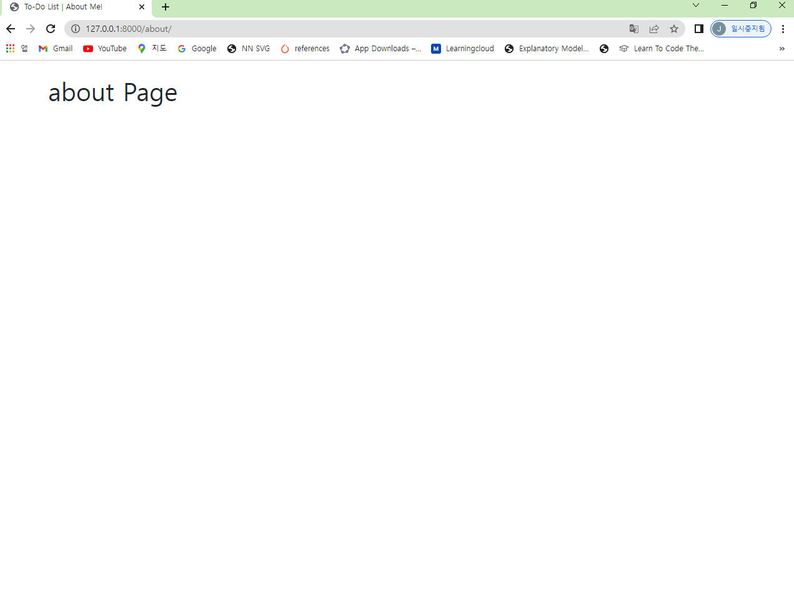


### (2) Bootstrap Navbar 
- 상단 메뉴를 고정하도록 한다. 
  + URL : https://getbootstrap.com/docs/5.1/components/navbar/
- base html 파일을 수정한다. 
  + nav 태그를 추가하도록 한다. 
```html
<!doctype html>
<html lang="en">

<head>
    <!-- Required meta tags -->
    <meta charset="utf-8">
    <meta name="viewport" content="width=device-width, initial-scale=1">

    <!-- Bootstrap CSS -->
    <link href="https://cdn.jsdelivr.net/npm/bootstrap@5.1.3/dist/css/bootstrap.min.css" rel="stylesheet"
        integrity="sha384-1BmE4kWBq78iYhFldvKuhfTAU6auU8tT94WrHftjDbrCEXSU1oBoqyl2QvZ6jIW3" crossorigin="anonymous">

    <title> Hello, world!  </title>
</head>

<body>
    <nav class="navbar navbar-expand-lg navbar-dark bg-dark">
        <div class="container-fluid">
            <a class="navbar-brand" href="">To-Do List</a>
            <button class="navbar-toggler" type="button" data-bs-toggle="collapse"
                data-bs-target="#navbarSupportedContent" aria-controls="navbarSupportedContent" aria-expanded="false"
                aria-label="Toggle navigation">
                <span class="navbar-toggler-icon"></span>
            </button>
            <div class="collapse navbar-collapse" id="navbarSupportedContent">
                <ul class="navbar-nav me-auto mb-2 mb-lg-0">
                    <li class="nav-item">
                        <a class="nav-link" href="">About</a>
                    </li>
                </ul>
                <form class="d-flex">
                    <input class="form-control me-2" type="search" placeholder="To-Do Item" aria-label="Search">
                    <button class="btn btn-outline-secondary" type="submit">일정 추가</button>
                </form>
            </div>
        </div>
    </nav>
    <br />
    <div class="container">
        
        
    </div>

    <!-- Optional JavaScript; choose one of the two! -->

    <!-- Option 1: Bootstrap Bundle with Popper -->
    <script src="https://cdn.jsdelivr.net/npm/bootstrap@5.1.3/dist/js/bootstrap.bundle.min.js"
        integrity="sha384-ka7Sk0Gln4gmtz2MlQnikT1wXgYsOg+OMhuP+IlRH9sENBO0LRn5q+8nbTov4+1p" crossorigin="anonymous">
    </script>

    <!-- Option 2: Separate Popper and Bootstrap JS -->
    <!--
    <script src="https://cdn.jsdelivr.net/npm/@popperjs/core@2.10.2/dist/umd/popper.min.js" integrity="sha384-7+zCNj/IqJ95wo16oMtfsKbZ9ccEh31eOz1HGyDuCQ6wgnyJNSYdrPa03rtR1zdB" crossorigin="anonymous"></script>
    <script src="https://cdn.jsdelivr.net/npm/bootstrap@5.1.3/dist/js/bootstrap.min.js" integrity="sha384-QJHtvGhmr9XOIpI6YVutG+2QOK9T+ZnN4kzFN1RtK3zEFEIsxhlmWl5/YESvpZ13" crossorigin="anonymous"></script>
    -->
</body>

</html>
```

- 결과는 다음과 같다. 
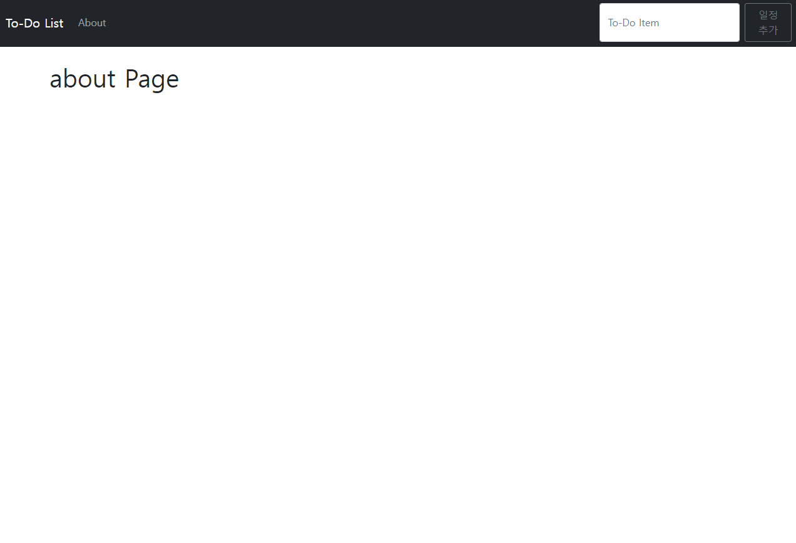

## Context Dictionary
- 이번엔 데이터를 딕셔너리로 저장 후, about.html로 표현하도록 해본다. 
- 크게 2개 파일을 수정할 것이다. 
  + views.py, about.html 
- 먼저 views.py 파일을 수정한다. 
```python
.
.
def about(request):
    context = {'first_name': 'John', 'last_name' : 'Elder'}
    return render(request, 'about.html', context)
```

- 이번에는 about.html 파일을 수정한다. 
```html


 To-Do List | About Me! 


<h1>about Page</h1>
<p>My Name is {{ first_name }} {{ last_name }}</p>

```

## Database Class

### (1) 데이터베이스 정의
- models.py에서 아래와 같이 클래스를 생성한다. 
  + 참조 : https://www.webforefront.com/django/modeldatatypesandvalidation.html
  + 파일경로 : todo_list/models.py
```py
from pyexpat import model
from django.db import models

# Create your models here.
class List(models.Model):
    item = models.CharField(max_length=200)
    completed = models.BooleanField(default=False)

    def __str__(self):
        return self.item
```

- 이번에는 DB를 생성한 후에는 migrations를 적용한다.
```bash
$ python manage.py makemigrations
Migrations for 'todo_list':
  todo_list\migrations\0001_initial.py
    - Create model List
$ python manage.py migrate
Operations to perform:
  Apply all migrations: admin, auth, contenttypes, ses
sions, todo_list
Running migrations:
  Applying todo_list.0001_initial... OK
``` 

### (2) 데이터베이스 Admin
- 이번엔 admin.py에서 admin site에 등록하는 예제를 작성한다. 
- 파일경로 : todo_list/admin.py

```python
from django.contrib import admin
from .models import List

# Register your models here.
admin.site.register(List)
```

- 이제 웹사이트에서 실제 Lists 데이터베이스가 생성되었는지 확인한다. 
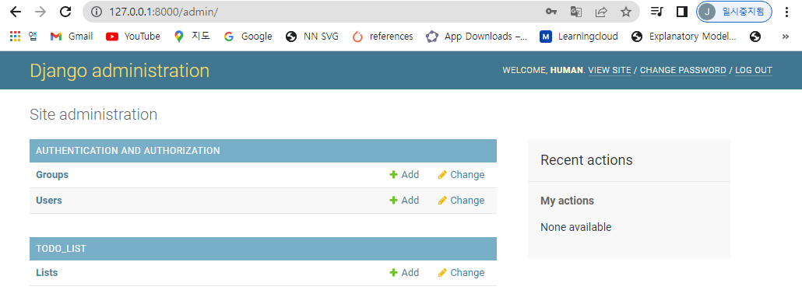

- 간단하게 오늘 할일을 기록해본다. 
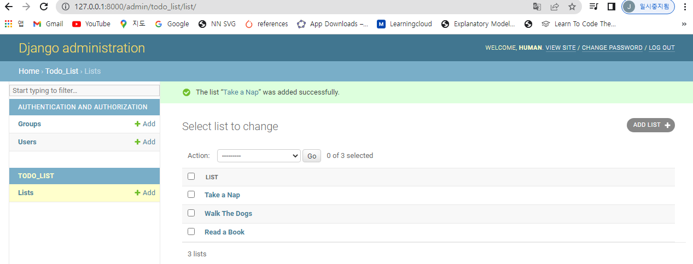

- 실제로 작업을 완료했는지 유무를 파악하기 위해 model.py를 수정한다. 
```python
from pyexpat import model
from django.db import models

# Create your models here.
class List(models.Model):
    item = models.CharField(max_length=200)
    completed = models.BooleanField(default=False)

    def __str__(self):
        return self.item + ' | ' + str(self.completed)
```

- 이제 다시 Admin 화면에서 True/False가 추가가 되었는지 확인해본다. 
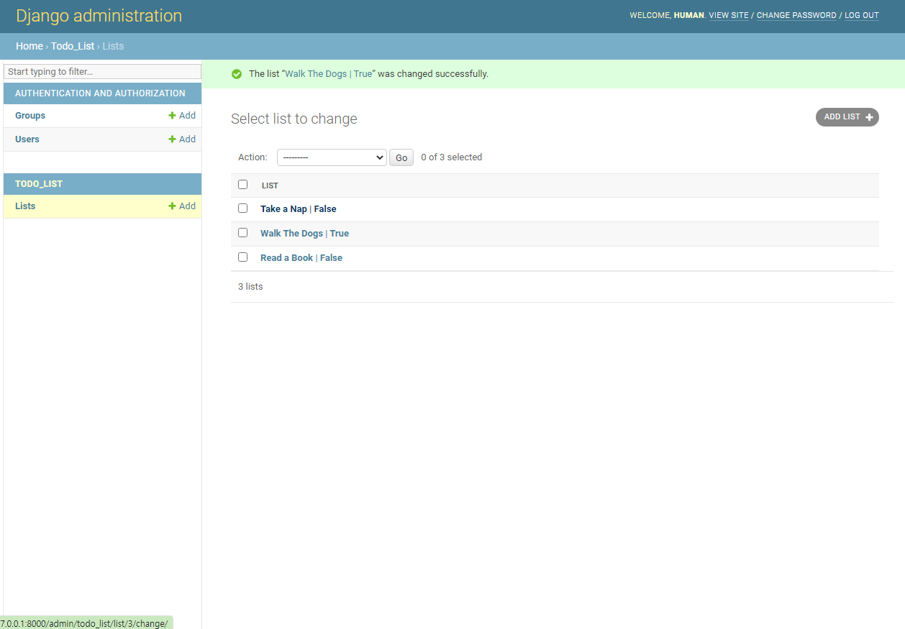

## 할일 목록 HTML에 보여주기
- DB에 저장된 항목을 HTML로 보여주는 코드를 작성한다. 

### (1) DB와 HTML 연동
- 우선 views.py를 수정한다. 
```python
from wsgiref.util import request_uri
from django.shortcuts import render
from .models import List

# Create your views here.
def home(request):
    all_items = List.objects.all
    return render(request, 'home.html', {'all_items' : all_items})

def about(request):
    context = {'first_name': 'Evan', 'last_name' : 'Elder'}
    return render(request, 'about.html', context)
```

- 이번에는 home.html 파일을 수정한다. 
```html


 To-Do List 


<h1>Hello World! HomePage!!</h1>

    
    <ul>
        
        <li>{{ things.item }} | {{ things.completed }}</li>
        
    </ul>
    


```

- 결과 화면은 다음과 같다. 
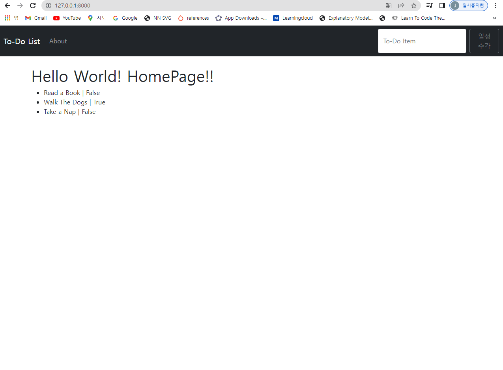

### (2) 테이블 정리
- 위 화면이 예쁘지가 않기 때문에, 테이블로 코드를 변경하도록 한다. 
- home.html 파일을 수정한다. 
```html


 To-Do List 


<h1>Hello World! HomePage!!</h1>

    
    <table class='table table-hover'>
        
            
                <tr class="table-success">
                    <td>{{ things.item }}</td>
                    <td><center>{{ things.completed }}</center></td>
                    <td><center>Delete</center></td>
                </tr>
            
                <tr>
                    <td>{{ things.item }}</td>
                    <td><center>{{ things.completed }}</center></td>
                    <td><center>Delete</center></td>
                </tr>
               
        
    </table>
    


```

- 결과물을 확인하도록 한다. 
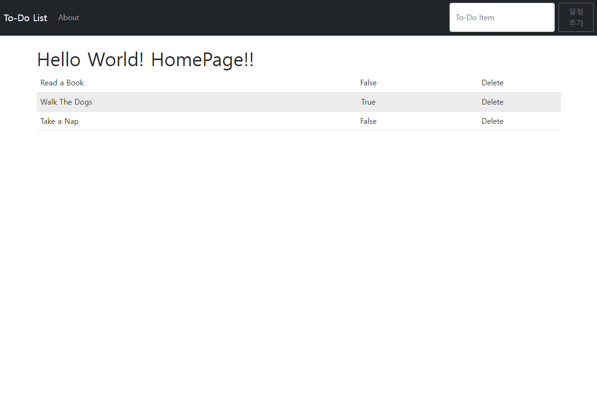

### (3) Static CSS Files
- 새로운 폴더를 만들도록 한다. 
- 우선 현재 경로를 확인한다. 
```bash
$  ls
img/  README.md  requirements.txt  venv/
```

- 프로젝트 폴더 내에 새로운 static 폴더를 생성하고  3가지를 생성한다. 
  + css 폴더 - my_style.css 파일을 추가로 생성한다. 
  + js 폴더
  + images 폴더

- 이번에는 todo_app 폴더 내 settings.py에서 아래와 같이 코드를 추가한다. 
```python
.
.
STATIC_URL = '/static/'
STATICFILES_DIRS = [
    os.path.join(BASE_DIR, 'static'), 
]
.
.
```

- 이번에는 my_style.css 파일에서 아래 css 코드를 추가한다. 
```css
.striker {
    text-decoration: line-through;
}
```

- 이번에는 todo_list/templates 폴더에서 base.html 파일을 수정한다. 
```html


<!doctype html>
<html lang="en">

<head>
    <!-- Required meta tags -->
    <meta charset="utf-8">
    <meta name="viewport" content="width=device-width, initial-scale=1">

    <!-- Bootstrap CSS -->
    <link href="https://cdn.jsdelivr.net/npm/bootstrap@5.1.3/dist/css/bootstrap.min.css" rel="stylesheet"
        integrity="sha384-1BmE4kWBq78iYhFldvKuhfTAU6auU8tT94WrHftjDbrCEXSU1oBoqyl2QvZ6jIW3" crossorigin="anonymous">
    <link href="" rel="stylesheet">

    <title> Hello, world!  </title>
</head>

<body>
    <nav class="navbar navbar-expand-lg navbar-dark bg-dark">
        <div class="container-fluid">
            <a class="navbar-brand" href="">To-Do List</a>
            <button class="navbar-toggler" type="button" data-bs-toggle="collapse"
                data-bs-target="#navbarSupportedContent" aria-controls="navbarSupportedContent" aria-expanded="false"
                aria-label="Toggle navigation">
                <span class="navbar-toggler-icon"></span>
            </button>
            <div class="collapse navbar-collapse" id="navbarSupportedContent">
                <ul class="navbar-nav me-auto mb-2 mb-lg-0">
                    <li class="nav-item">
                        <a class="nav-link" href="">About</a>
                    </li>
                </ul>
                <form class="d-flex">
                    <input class="form-control me-2" type="search" placeholder="To-Do Item" aria-label="Search">
                    <button class="btn btn-outline-secondary" type="submit">일정 추가</button>
                </form>
            </div>
        </div>
    </nav>
    <br />
    <div class="container">
        
        
    </div>

    <!-- Optional JavaScript; choose one of the two! -->

    <!-- Option 1: Bootstrap Bundle with Popper -->
    <script src="https://cdn.jsdelivr.net/npm/bootstrap@5.1.3/dist/js/bootstrap.bundle.min.js"
        integrity="sha384-ka7Sk0Gln4gmtz2MlQnikT1wXgYsOg+OMhuP+IlRH9sENBO0LRn5q+8nbTov4+1p" crossorigin="anonymous">
    </script>

    <!-- Option 2: Separate Popper and Bootstrap JS -->
    <!--
    <script src="https://cdn.jsdelivr.net/npm/@popperjs/core@2.10.2/dist/umd/popper.min.js" integrity="sha384-7+zCNj/IqJ95wo16oMtfsKbZ9ccEh31eOz1HGyDuCQ6wgnyJNSYdrPa03rtR1zdB" crossorigin="anonymous"></script>
    <script src="https://cdn.jsdelivr.net/npm/bootstrap@5.1.3/dist/js/bootstrap.min.js" integrity="sha384-QJHtvGhmr9XOIpI6YVutG+2QOK9T+ZnN4kzFN1RtK3zEFEIsxhlmWl5/YESvpZ13" crossorigin="anonymous"></script>
    -->
</body>

</html>
```

- 실제 적용하기 위해서 home.html 파일을 수정한다. 
  + td 태그에 클래스명 striker를 추가한다. 
```html


 To-Do List 


<h1>Hello World! HomePage!!</h1>

    
    <table class='table table-hover'>
        
            
                <tr class="table-success">
                    <td class="striker">{{ things.item }}</td>
                    <td><center>{{ things.completed }}</center></td>
                    <td><center>Delete</center></td>
                </tr>
            
                <tr>
                    <td>{{ things.item }}</td>
                    <td><center>{{ things.completed }}</center></td>
                    <td><center>Delete</center></td>
                </tr>
               
        
    </table>
    


```

- 아래와 같이 CSS가 적용되는지 확인한다. 


### (4) Forms 파일
- Forms 파일을 작성한다. 
- 화면단에서 일정을 추가하면 반영하도록 작성하는 코드이다. 
    + my_app/todo_list/forms.py
```python
from django import forms
from .models import List

class ListForm(forms.ModelForm):
    class Meta:
        model = List
        fields = ["item", "completed"]
```

- 이번에는 base.html 파일을 수정한다. 
    + form 태그를 아래와 같이 수정한다. 
```html
.
.
.
              <form class="d-flex" method="POST">
                  
                  <input class="form-control me-2" type="search" placeholder="To-Do Item" aria-label="Search" ,
                      name="item">
                  <button class="btn btn-outline-secondary" type="submit">일정 추가</button>
              </form>
.
.
.
```

- 이번에는 `views.py`을 수정한다. 
```python
from wsgiref.util import request_uri
from django.shortcuts import render
from .models import List
from .forms import ListForm

# Create your views here.
def home(request):
    if request.method == 'POST':
        form = ListForm(request.POST or None)
        
        if form.is_valid():
            form.save()
            all_items = List.objects.all
            return render(request, 'home.html', {'all_items' : all_items})
    else:
        all_items = List.objects.all
        return render(request, 'home.html', {'all_items' : all_items})
def about(request):
    context = {'first_name': 'Evan', 'last_name' : 'Elder'}
    return render(request, 'about.html', context)
```

- 이제 아래 그림과 같이 새로운 일정을 추가할 수 있을 것이다. 
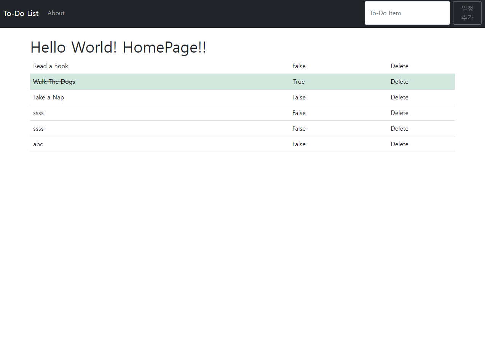

### (5) 메시지 생성
- 새로운 아이템이 추가가 될 때마다 메시지가 테이블 위에 생성이 되도록 작성해본다. 
- views.py을 다시 수정해본다. 
    + messages 코드가 추가가 된 것이다. 
```python
from wsgiref.util import request_uri
from django.shortcuts import render
from .models import List
from .forms import ListForm
from django.contrib import messages

# Create your views here.
def home(request):
    if request.method == 'POST':
        form = ListForm(request.POST or None)
        
        if form.is_valid():
            form.save()
            all_items = List.objects.all
            messages.success(request, ('Item Has Been Added To List!'))
            return render(request, 'home.html', {'all_items' : all_items})
    else:
        all_items = List.objects.all
        return render(request, 'home.html', {'all_items' : all_items})
def about(request):
    context = {'first_name': 'Evan', 'last_name' : 'Elder'}
    return render(request, 'about.html', context)
```

- 이번에는 `home.html` 파일을 수정한다. 
```html


 To-Do List 


<h1>Hello World! HomePage!!</h1>



<div class="alert alert-warning alert-dismissible fade show" role="alert">
    <button class="btn-close" data-bs-dismiss="alert" aria-label="Close">
        <small><sup></sup></small>
    </button>
    {{ message }}
</div>





<table class='table table-hover'>
    
    
    <tr class="table-success">
        <td class="striker">{{ things.item }}</td>
        <td>
            <center>{{ things.completed }}</center>
        </td>
        <td>
            <center>Delete</center>
        </td>
    </tr>
    
    <tr>
        <td>{{ things.item }}</td>
        <td>
            <center>{{ things.completed }}</center>
        </td>
        <td>
            <center>Delete</center>
        </td>
    </tr>
    
    
</table>



```

- 위 코드가 정상적으로 작동을 하면 아래와 같은 화면이 나타난다. 


### (6) 할 일 목록 삭제
- 이제 Delete 버튼을 활성화하여 삭제 기능이 정상적으로 작동이 되도록 한다. 
- todo_list/urls.py을 수정한다. 
    + 삭제 시, 경로를 지정하는 것이다. 
```python
from django.urls import path
from . import views

urlpatterns = [
    path('', views.home, name='home'), 
    path('about/', views.about, name='about'),
    path('delete/<list_id>', views.delete, name='delete'),
]
```

- 이번에는 views.py를 수정한다. 
    + item을 삭제 한 후, 메시지 생성 및 home으로 redirect를 진행한다. 
    + 기존 코드에서 주어진 다음 코드를 추가한다. 
```python
from wsgiref.util import request_uri
from django.shortcuts import redirect, render, redirect
.
.
.
from django.http import HttpResponseRedirect

# Create your views here.
.
.
.

def delete(request, list_id):
    item = List.objects.get(pk=list_id)
    item.delete()
    messages.success(request, ('Item has been deleted!'))
    return redirect('home')
```

- 이번에는 home.html 코드를 수정한다. 
```html


 To-Do List 


<h1>Hello World! HomePage!!</h1>



<div class="alert alert-warning alert-dismissible fade show" role="alert">
    <button class="btn-close" data-bs-dismiss="alert" aria-label="Close">
        <small><sup></sup></small>
    </button>
    {{ message }}
</div>





<table class='table table-hover'>
    
    
    <tr class="table-success">
        <td class="striker">{{ things.item }}</td>
        <td>
            <center>{{ things.completed }}</center>
        </td>
        <td>
            <center><a href="">Delete</a></center>
        </td>
    </tr>
    
    <tr>
        <td>{{ things.item }}</td>
        <td>
            <center>{{ things.completed }}</center>
        </td>
        <td>
            <center><a href="">Delete</a></center>
        </td>
    </tr>
    
    
</table>



```

- 실제로 삭제가 진행되는지 확인한다. 

### (7) Cross and Uncross Items
- 현재 화면단에 true or false로 되어 있는데, 이 부분은 Uncross와 Cross Off로 정의한다. 
- 우선 urls.py를 수정한다. 
```python
"""todo_app URL Configuration

The `urlpatterns` list routes URLs to views. For more information please see:
    https://docs.djangoproject.com/en/4.0/topics/http/urls/
Examples:
Function views
    1. Add an import:  from my_app import views
    2. Add a URL to urlpatterns:  path('', views.home, name='home')
Class-based views
    1. Add an import:  from other_app.views import Home
    2. Add a URL to urlpatterns:  path('', Home.as_view(), name='home')
Including another URLconf
    1. Import the include() function: from django.urls import include, path
    2. Add a URL to urlpatterns:  path('blog/', include('blog.urls'))
"""
from django.urls import path
from . import views

urlpatterns = [
    path('', views.home, name='home'), 
    path('about/', views.about, name='about'),
    path('delete/<list_id>', views.delete, name='delete'),
    path('cross_off/<list_id>', views.cross_off, name='cross_off'),
    path('uncross/<list_id>', views.uncross, name='uncross'),
]
```

- 이번에는 views.py에서 두개의 함수 cross_off()와 uncross()를 추가한다. 
```python
.
.
.
def cross_off(request, list_id):
    item = List.objects.get(pk=list_id)
    item.completed = True
    item.save()
    return redirect('home')

def uncross(request, list_id):
    item = List.objects.get(pk=list_id)
    item.completed = False
    item.save()
    return redirect('home')
```

- 이번에는 home.html 파일을 수정한다. 
```python
.
.
.
<tr class="table-success">
        <td class="striker">{{ things.item }}</td>
        <td>
            <center><a href="">Uncross</a></center>
        </td>
        <td>
            <center><a href="">Delete</a></center>
        </td>
    </tr>
    
    <tr>
        <td>{{ things.item }}</td>
        <td>
            <center><a href="">Cross Off</a></center>
        </td>
        <td>
            <center><a href="">Delete</a></center>
        </td>
    </tr>
.
.
.
```

- 정상적으로 실행을 결과는 아래와 같이 나올 것이다. 
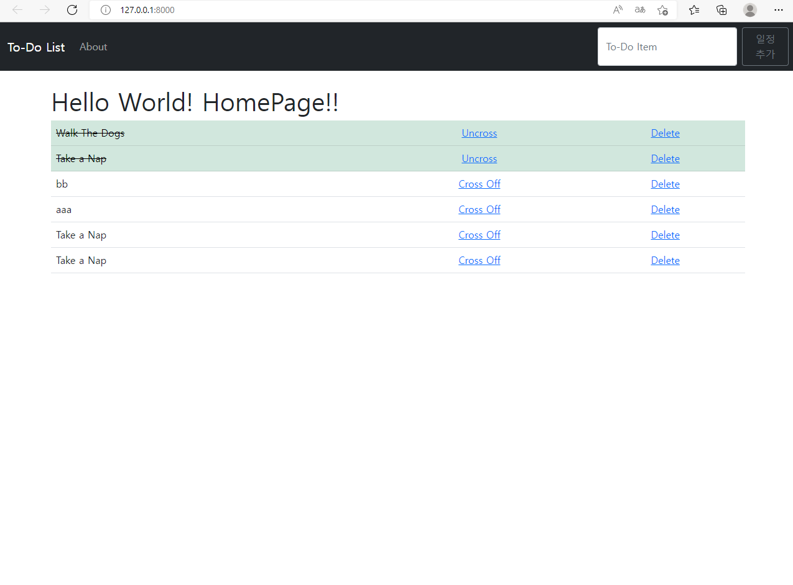


### (8) 할 일 목록 수정
- Item을 클릭하면 수정페이지로 넘어가서 처리하는 작업을 진행하도록 한다. 

- 먼저 urls.py를 수정한다. 
```python
from django.urls import path
from . import views

urlpatterns = [
    path('', views.home, name='home'), 
    path('about/', views.about, name='about'),
    path('delete/<list_id>', views.delete, name='delete'),
    path('cross_off/<list_id>', views.cross_off, name='cross_off'),
    path('uncross/<list_id>', views.uncross, name='uncross'),
    path('edit/<list_id>', views.edit, name='edit'),
]
```

- 이번에는 views.py에서 edit()함수를 추가한다. 
```python
.
.
.
def edit(request, list_id):
    if request.method == 'POST':
        item = List.objects.get(pk=list_id)

        form = ListForm(request.POST or None, instance=item)
        
        if form.is_valid():
            form.save()
            messages.success(request, ('Item has been Edited'))
            return redirect('home')
    else:
        item = List.objects.get(pk=list_id)
        return render(request, 'edit.html', {'item' : item})

```

- 이번에는 home.html 파일을 수정한다. 
```html
.
.
.
<tr class="table-success">
        <td class="striker"><a href="">{{ things.item }}</a></td>
        <td>
            <center><a href="">Uncross</a></center>
        </td>
        <td>
            <center><a href="">Delete</a></center>
        </td>
    </tr>
    
    <tr>
        <td><a href="">{{ things.item }}</a></td>
        <td>
            <center><a href="">Cross Off</a></center>
        </td>
        <td>
            <center><a href="">Delete</a></center>
        </td>
    </tr>
.
.
.
```

- 이번에는 edit.html 파일을 생성한다. 
```html


 To-Do List | Edit Item 



    
    <form class="d-flex" method="POST">
        
        <input class="form-control me-2" type="search" placeholder="{{ item.item }}" aria-label="Search", value = "{{ item.item }}" name="item">

        <input type="hidden" value = "{{ item.completed }}" name="completed">

        <button class="btn btn-outline-secondary" type="submit">Edit Item</button>
    </form>

    

```

- home.html 파일에서 item을 클릭하면 수정 페이지를 확인할 수 있다. 

# 최종 폴더 경로
```
$ tree -L 2
.
|-- README.md
|-- db.sqlite3
|-- manage.py
|-- requirements.txt
|-- static
|   `-- css
|-- todo_app
|   |-- __init__.py
|   |-- __pycache__
|   |-- asgi.py
|   |-- settings.py
|   |-- urls.py
|   `-- wsgi.py
|-- todo_list
|   |-- __init__.py
|   |-- __pycache__
|   |-- admin.py
|   |-- apps.py
|   |-- forms.py
|   |-- migrations
|   |-- models.py
|   |-- templates
|   |-- tests.py
|   |-- urls.py
|   `-- views.py
`-- venv
    |-- Lib
    |-- Scripts
    `-- pyvenv.cfg
```